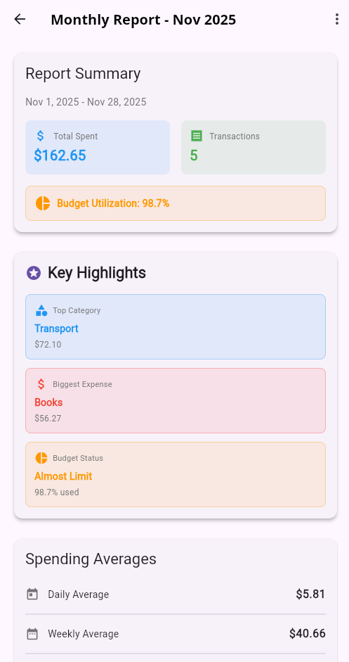
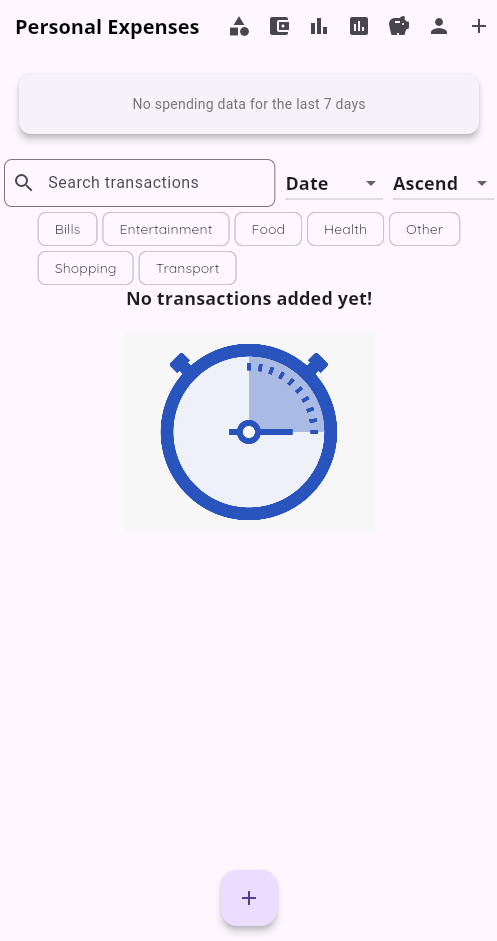

# Week 10 Progress Report

## (11/17/2025 - 11/23/2025)

> Team: Pocket Protectors
>
> - Anna Dinius, Jeff Perdue, Cody King, Dillon Carpenter

---

## Milestones Completed - Jeff

✅ Enhanced validation feedback  
✅ Added report highlights  
✅ Chart responsiveness  
✅ Formatting improvements  
✅ Expanded testing

- _Fulfills 0 requirements_ (all requirements already completed)

---

  

---

## Milestones Completed - Cody

✅ Generated more unit tests to cover more edge cases for saving goals feature
✅ More manual testing to ensure no bugs and that all requirements are covered

- _Fulfills 0 requirements_ (all requirements already completed)

---

## Milestones Completed - Dillon

✅ UI improvements
✅ Tested app with an Android Emulator

- _Fulfills 0 requirements_ (all requirements already completed)

---

  

---

## LoC Summary

### Individual Contributions:

- Jeff: ~600+
- Cody: ~600
- Dillon: ~32

### Codebase LoC Summary After Integration:

- **Total**: 17,340
- **Counting rules**: Excludes empty lines and comment-only lines. Inline comments on code lines are still counted.
- **Files scanned**: All files under `lib` and `test` and their subdirectories.

---

### Codebase LoC Breakdown:

High-level source files, models, and widgets:

- `lib\firebase_options.dart`: 70
- `lib\main.dart`: 332
- `lib\model\budget.dart`: 256
- `lib\model\category.dart`: 121
- `lib\model\report.dart`: 338
- `lib\model\savings_goal.dart`: 131
- `lib\model\transaction.dart`: 142

---

Services and theme:

- `lib\service\analytics_service.dart`: 298
- `lib\service\auth_service.dart`: 32
- `lib\service\budget_service.dart`: 439
- `lib\service\category_service.dart`: 290
- `lib\service\report_export_service.dart`: 557
- `lib\service\report_service.dart`: 199
- `lib\service\savings_goal_service.dart`: 73
- `lib\service\update_transaction_service.dart`: 44
- `lib\service\user_service.dart`: 60
- `lib\theme\main_theme.dart`: 35

---

Views:

- `lib\view\budgets_list.dart`: 416
- `lib\view\chart.dart`: 150
- `lib\view\chart_bar.dart`: 59
- `lib\view\chart_pie.dart`: 139
- `lib\view\charts_overview.dart`: 999
- `lib\view\edit_budget.dart`: 335
- `lib\view\edit_savings_goal.dart`: 192
- `lib\view\generate_report.dart`: 382
- `lib\view\manage_categories.dart`: 579
- `lib\view\new_budget.dart`: 328

---

Views (cont.):

- `lib\view\new_savings_goal.dart`: 157
- `lib\view\new_transaction.dart`: 232
- `lib\view\profile_creation.dart`: 120
- `lib\view\profile_editing.dart`: 235
- `lib\view\profile_summary.dart`: 94
- `lib\view\report_detail.dart`: 967
- `lib\view\report_list.dart`: 364
- `lib\view\savings_dashboard.dart`: 502
- `lib\view\savings_goals_list.dart`: 119

---

Views (cont.):

- `lib\view\savings_summary.dart`: 434
- `lib\view\search_bar_widget.dart`: 146
- `lib\view\sign_in.dart`: 77
- `lib\view\transaction_list.dart`: 112
- `lib\view\widgets\category_badge.dart`: 79
- `lib\view\widgets\category_picker.dart`: 275

---

Tests:

- `test\error_handling\category_error_test.dart`: 246
- `test\fixtures\category_test_data.dart`: 158
- `test\helpers\analytics_test_helpers.dart`: 112
- `test\helpers\test_helpers.dart`: 26
- `test\integration\data_model_tests.dart`: 306
- `test\integration\transaction_analysis_tests.dart`: 229
- `test\integration\user_workflow_integration_tests.dart`: 488
- `test\integration\widget_smoke_tests.dart`: 334
- `test\model\category_test.dart`: 228

---

Tests (cont.):

- `test\model\default_categories_test.dart`: 105
- `test\model\savings_goal_test.dart`: 662
- `test\service\analytics_service_test.dart`: 311
- `test\service\budget_service_test.dart`: 607
- `test\service\category_service_test.dart`: 185
- `test\service\category_service_working_test.dart`: 185
- `test\service\report_service_test.dart`: 402
- `test\service\savings_goal_service_test.dart`: 500
- `test\service\user_service_test.dart`: 112

---

Tests (cont.):

- `test\transaction_test.dart`: 92
- `test\update_recurring_transactions_test.dart`: 53
- `test\view\profile_creation_test.dart`: 95
- `test\view\profile_editing_test.dart`: 46
- `test\view\profile_summary_test.dart`: 19
- `test\view\search_bar_widget_test.dart`: 157
- `test\view\sign_in_test.dart`: 71
- `test\view\widgets\category_badge_test.dart`: 294
- `test\view\widgets\category_picker_test.dart`: 408

---

## Tests

- **Total number of test files**: 27
- **Total number of tests**: 330
  - All tests pass
- **Total test LoC**: 6,431

---

## 🔥 Burndown rate

- 35/35 Sprint 2 requirements completed
  - 100% total
  - 20% per week
  - ~3% per day
