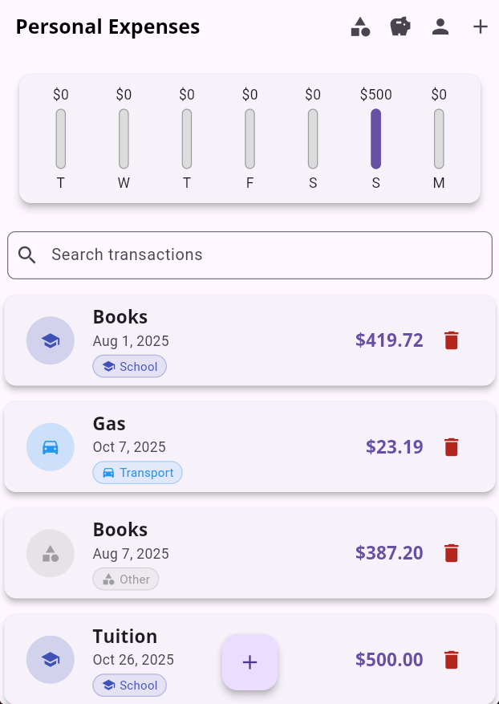
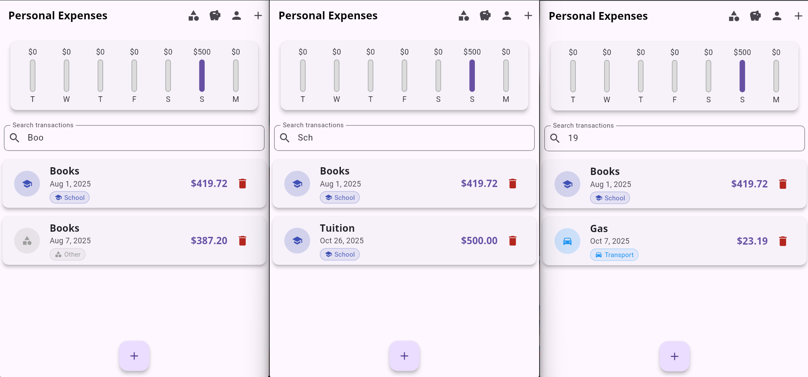
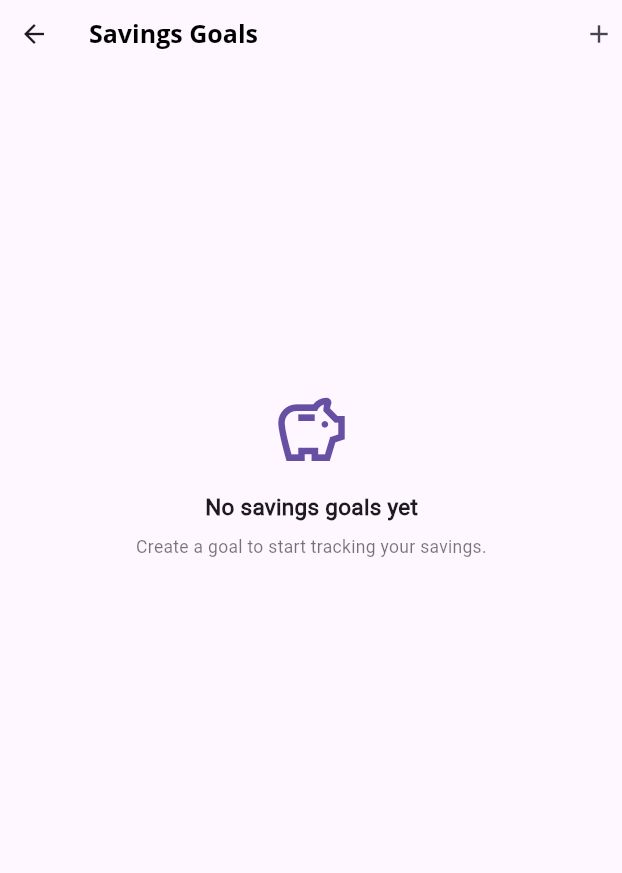
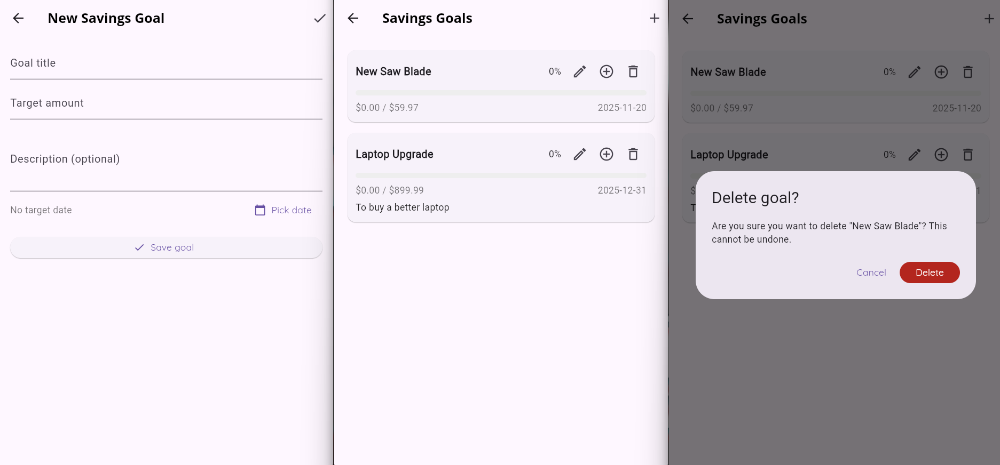
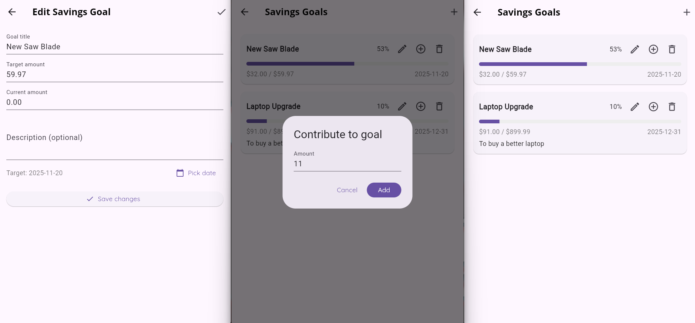

# Week 6 Progress Report

## (10/20/2025 - 10/26/2025)

> Team: Pocket Protectors
>
> - Anna Dinius, Jeff Perdue, Cody King, Dillon Carpenter

---

## Milestones Completed - Jeff

✅ Finalized requirements
✅ Designed data models
✅ Developed budgets and analytics services
✅ Wrote unit tests

- _Fulfills 0 requirements_, but creates a solid foundation to work off of

---

## Milestones Completed - Cody

✅ Designed savings goal data model
✅ Implemented UI and backend for creating, editing, deleting, and contributing to goals
✅ Conducted manual tests

- _Fulfills 4 requirements_

---

## Milestones Completed - Dillon

✅ Implemented UI and backend for searching transactions by title, category, or amount with real-time updates

- _Fulfills 3 requirements_

---

---

---

---

---

---

## LoC Summary

### Individual Contributions:

- Cody: ~1,022
- Jeff: ~1,640
- Dillon: ~86

### Codebase LoC Summary After Integration:

- **Total**: 7,872
- **Counting rules**: Excludes empty lines and comment-only lines. Inline comments on code lines are still counted.
- **Files scanned**: All files under `lib` and `test` and their subdirectories.

---

### Codebase LoC Breakdown:

High-level source files, models, and widgets:

- `lib\firebase_options.dart`: 70
- `lib\main.dart`: 299
- `lib\model\budget.dart`: 256
- `lib\model\category.dart`: 121
- `lib\model\report.dart`: 338
- `lib\model\savings_goal.dart`: 117
- `lib\model\transaction.dart`: 143
- `lib\search_bar_widget.dart`: 75

---

Services and theme:

- `lib\service\analytics_service.dart`: 275
- `lib\service\auth_service.dart`: 32
- `lib\service\budget_service.dart`: 412
- `lib\service\category_service.dart`: 290
- `lib\service\savings_goal_service.dart`: 92
- `lib\service\update_transaction_service.dart`: 44
- `lib\service\user_service.dart`: 60
- `lib\theme\main_theme.dart`: 35

---

Views:

- `lib\view\chart.dart`: 57
- `lib\view\chart_bar.dart`: 51
- `lib\view\edit_savings_goal.dart`: 189
- `lib\view\manage_categories.dart`: 579
- `lib\view\new_savings_goal.dart`: 161
- `lib\view\new_transaction.dart`: 232
- `lib\view\profile_creation.dart`: 121
- `lib\view\profile_editing.dart`: 233
- `lib\view\profile_summary.dart`: 74
- `lib\view\savings_goals_list.dart`: 119

---

Views (cont.):

- `lib\view\savings_summary.dart`: 216
- `lib\view\sign_in.dart`: 77
- `lib\view\transaction_list.dart`: 112
- `lib\view\widgets\category_badge.dart`: 79
- `lib\view\widgets\category_picker.dart`: 275

---

Tests:

- `test\error_handling\category_error_test.dart`: 247
- `test\fixtures\category_test_data.dart`: 158
- `test\helpers\test_helpers.dart`: 26
- `test\model\category_test.dart`: 228
- `test\model\default_categories_test.dart`: 105
- `test\service\budget_service_test.dart`: 279
- `test\service\category_service_test.dart`: 186
- `test\service\category_service_working_test.dart`: 186
- `test\service\savings_goal_service_test.dart`: 34
- `test\service\user_service_test.dart`: 112

---

Tests (cont.):

- `test\transaction_test.dart`: 92
- `test\update_recurring_transactions_test.dart`: 52
- `test\view\profile_creation_test.dart`: 95
- `test\view\profile_editing_test.dart`: 46
- `test\view\profile_summary_test.dart`: 19
- `test\view\sign_in_test.dart`: 71
- `test\view\widgets\category_badge_test.dart`: 294
- `test\view\widgets\category_picker_test.dart`: 408

---

## 🔥 Burndown rate

- 7/35 Sprint 2 requirements completed
  - 20% total
  - 20% per week
  - ~3% per day
