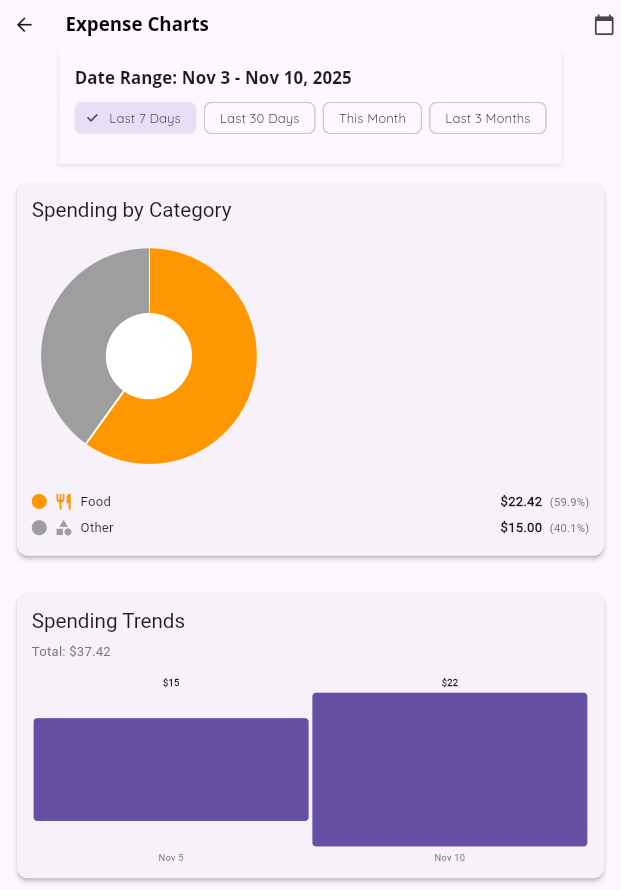
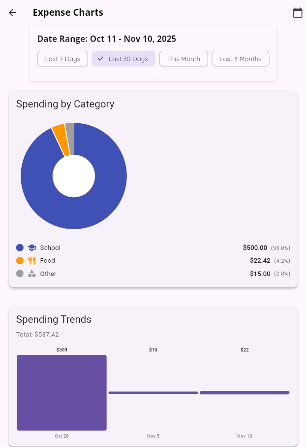
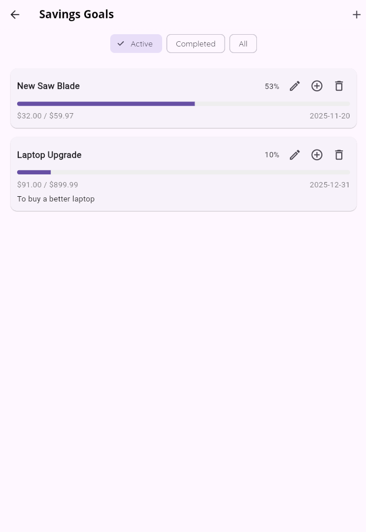
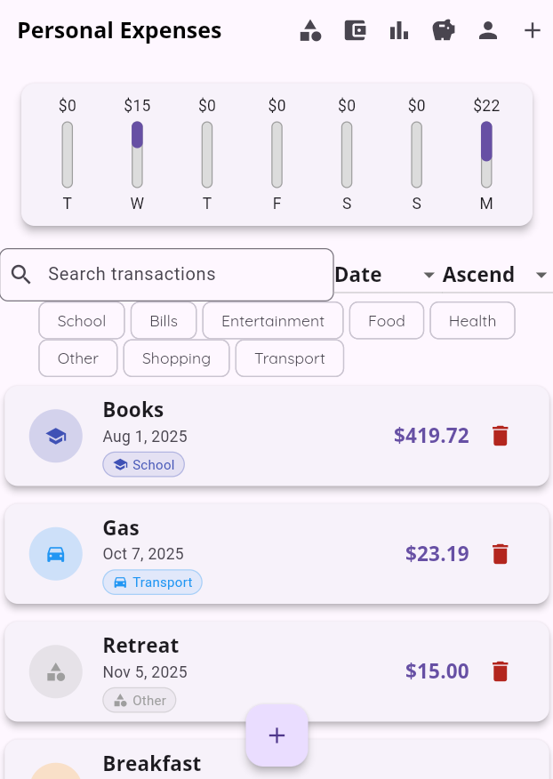

# Week 8 Progress Report

## (11/3/2025 - 11/9/2025)

> Team: Pocket Protectors
>
> - Anna Dinius, Jeff Perdue, Cody King, Dillon Carpenter

---

## Milestones Completed - Jeff

✅ Integrate AnalyticsService with Chart Views
✅ Implement Category-Based Visualizations
✅ Enhance Existing Chart Components
✅ Create Chart Overview Screen
✅ Unit Testing for AnalyticsService

- _Fulfills 2 requirements_

---

  
  

---

## Milestones Completed - Cody

✅ Added celebration notifications on screen when user reaches (50%, 75%, and 100%)
✅ Added filter on savings goals screen to filter by active/completed goals or show all
✅ More regression testing

- _Fulfills 1 requirement_

---

---

## Milestones Completed - Dillon

✅ Finished Sort feature
✅ Finished Filter feature
✅ Created tests

- _Fulfills 6 requirements_

---

---

## LoC Summary

### Individual Contributions:

- Jeff: ~1,705
- Cody: ~410
- Dillon: ~252

### Codebase LoC Summary After Integration:

- **Total**: 11,483
- **Counting rules**: Excludes empty lines and comment-only lines. Inline comments on code lines are still counted.
- **Files scanned**: All files under `lib` and `test` and their subdirectories.

---

### Codebase LoC Breakdown:

High-level source files and models:

- `root\lib\firebase_options.dart`: 70
- `root\lib\main.dart`: 312
- `root\lib\model\budget.dart`: 256
- `root\lib\model\category.dart`: 121
- `root\lib\model\report.dart`: 338
- `root\lib\model\savings_goal.dart`: 131
- `root\lib\model\transaction.dart`: 143

---

Services and theme:

- `root\lib\service\analytics_service.dart`: 275
- `root\lib\service\auth_service.dart`: 32
- `root\lib\service\budget_service.dart`: 415
- `root\lib\service\category_service.dart`: 290
- `root\lib\service\savings_goal_service.dart`: 73
- `root\lib\service\update_transaction_service.dart`: 44
- `root\lib\service\user_service.dart`: 60
- `root\lib\theme\main_theme.dart`: 35

---

Views:

- `root\lib\view\budgets_list.dart`: 403
- `root\lib\view\chart.dart`: 149
- `root\lib\view\chart_bar.dart`: 57
- `root\lib\view\chart_pie.dart`: 104
- `root\lib\view\charts_overview.dart`: 918
- `root\lib\view\edit_budget.dart`: 311
- `root\lib\view\edit_savings_goal.dart`: 192
- `root\lib\view\manage_categories.dart`: 579
- `root\lib\view\new_budget.dart`: 309
- `root\lib\view\new_savings_goal.dart`: 157
- `root\lib\view\new_transaction.dart`: 232

---

Views (cont.):

- `root\lib\view\profile_creation.dart`: 121
- `root\lib\view\profile_editing.dart`: 233
- `root\lib\view\profile_summary.dart`: 74
- `root\lib\view\savings_goals_list.dart`: 119
- `root\lib\view\savings_summary.dart`: 422
- `root\lib\view\search_bar_widget.dart`: 145
- `root\lib\view\sign_in.dart`: 77
- `root\lib\view\transaction_list.dart`: 112
- `root\lib\view\widgets\category_badge.dart`: 79
- `root\lib\view\widgets\category_picker.dart`: 275

---

Tests:

- `root\test\error_handling\category_error_test.dart`: 247
- `root\test\fixtures\category_test_data.dart`: 158
- `root\test\helpers\analytics_test_helpers.dart`: 112
- `root\test\helpers\test_helpers.dart`: 26
- `root\test\model\category_test.dart`: 228
- `root\test\model\default_categories_test.dart`: 105
- `root\test\model\savings_goal_test.dart`: 404
- `root\test\service\analytics_service_test.dart`: 311
- `root\test\service\budget_service_test.dart`: 282
- `root\test\service\category_service_test.dart`: 186

---

Tests (cont.):

- `root\test\service\category_service_working_test.dart`: 186
- `root\test\service\savings_goal_service_test.dart`: 252
- `root\test\service\user_service_test.dart`: 112
- `root\test\transaction_test.dart`: 92
- `root\test\update_recurring_transactions_test.dart`: 52
- `root\test\view\profile_creation_test.dart`: 95
- `root\test\view\profile_editing_test.dart`: 46
- `root\test\view\profile_summary_test.dart`: 19
- `root\test\view\search_bar_widget_test.dart`: 134
- `root\test\view\sign_in_test.dart`: 71

---

Tests (cont.):

- `root\test\view\widgets\category_badge_test.dart`: 294
- `root\test\view\widgets\category_picker_test.dart`: 408

---

## Tests

- **Total number of test files**: 22
- **Total number of tests**: 267
- **Total LoC**: 3,820

---

## 🔥 Burndown rate

- 21/35 Sprint 2 requirements completed
  - 60% total
  - 20% per week
  - ~3% per day
